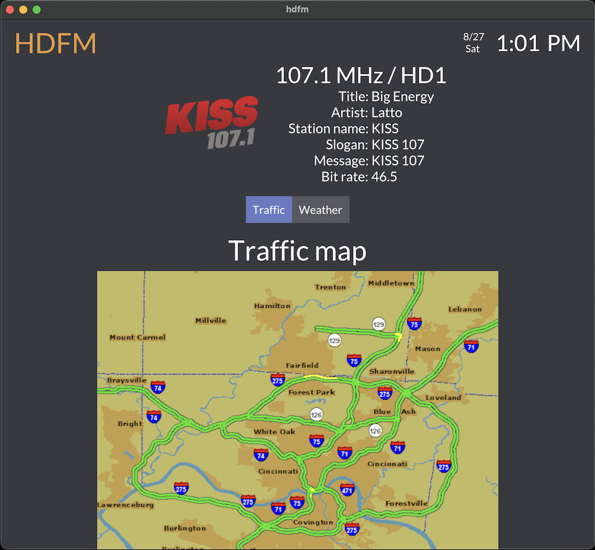
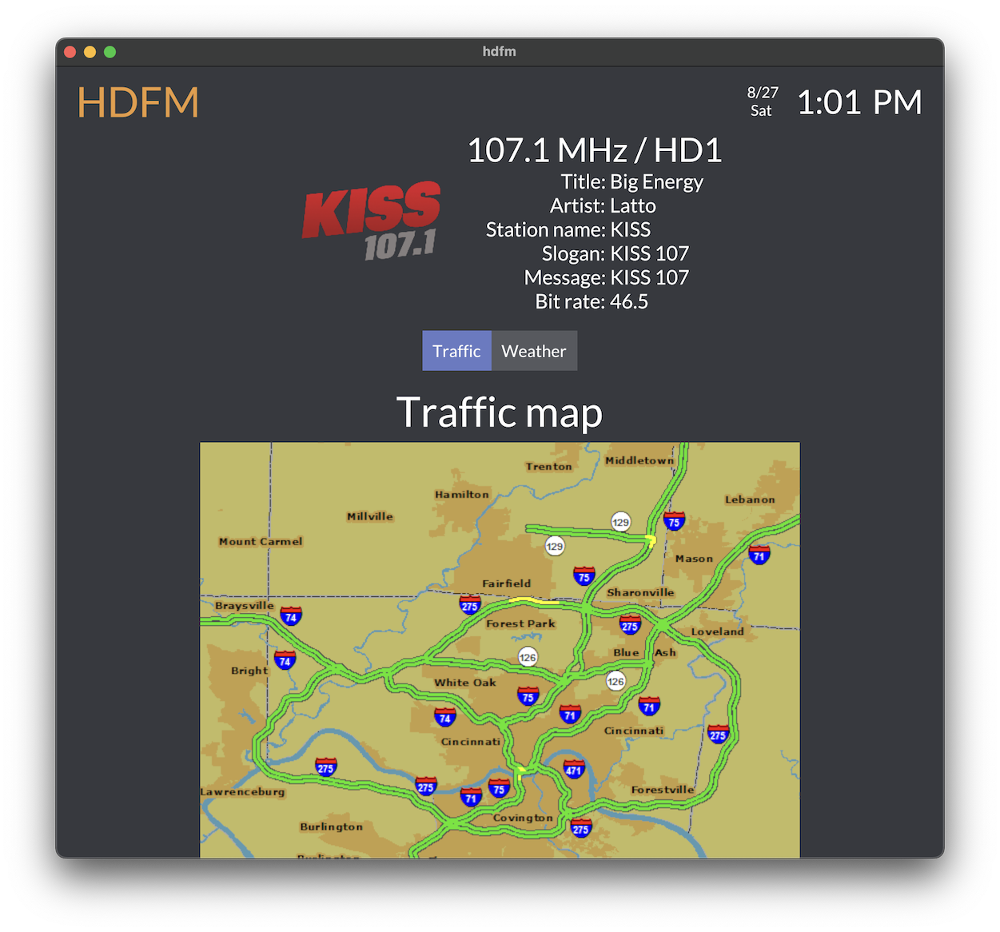

# HDFM
Displays live weather, traffic, album artwork, and song/station data received from HD Radio stations

### Overview
**hdfm** is a Python script designed to process data broadcasted by iHeartRadio HD Radio stations and display it in 
real time. This data includes traffic and weather maps, as well as album/station art and station/song details.

This script sources its data from another program [nrsc5](https://github.com/theori-io/nrsc5), which was developed to
decode HD Radio signals using an inexpensive [RTL-SDR receiver](https://www.rtl-sdr.com). More information can be 
found on nrsc5 [here](https://theori.io/research/nrsc-5-c). If you haven't heard of an RTL-SDR receiver before or do 
not own one, I would highly recommend purchasing one. There are many unique projects that can be done with them and 
they are extremely inexpensive.

Some potential uses of this script include receiving weather and traffic data while off the grid (but near a radio 
station) or creating a custom car navigation system.

Keep in mind this program will ONLY work with iHeartRadio stations. If you encounter any problems, just open an issue
and I'll do my best to help.

### Packages

 * Python 3 (preferably 3.6 or higher)
 * `python3-tk` (Default with some installations; others need it manually installed)
 * `nrsc5` (installation instructions available [here](https://github.com/theori-io/nrsc5))

### Libraries

 * `Pillow` (PIL fork, `pip3 install Pillow`)

### Other Requirements

An RTL-SDR dongle which can be found [here](http://a.co/d/1qduCLG).

### Usage:

	Usage:  [OPTIONS]  frequency
	
     Option              Meaning
     -h, --help          Show this message
     -c <program>        HD Radio program, for stations with subchannels (default = 0)
     -p <ppm>            PPM error correction (default = 0)
     -s <dir>            Directory to save weather and traffic images to (default = none)
     -l <null>           Show logging information
	 -a <null>           Display album/station art
### Examples:

Tune to 104.5 MHz:

     $ ./hdfm.py 104.5

Tune to 104.5 MHz, display album/station artwork, and save all received maps to `saves/`:

     $ ./hdfm.py -a -s saves 104.5

Tune to 104.5 MHz, set the ppm correction to 48, and decode HD program 2 (HD2)

     $ ./hdfm.py -p 48 -c 1 104.5

### Compatible Stations

A list of nearby HD Radio stations can be found by entering your zip code at this website:
https://hdradio.com/stations

A list of all compatible iHeartRadio stations in the US can be found here:
https://en.wikipedia.org/wiki/List_of_radio_stations_owned_by_iHeartMedia

The station must be HD and operated by iHeartRadio for this program to function properly.

