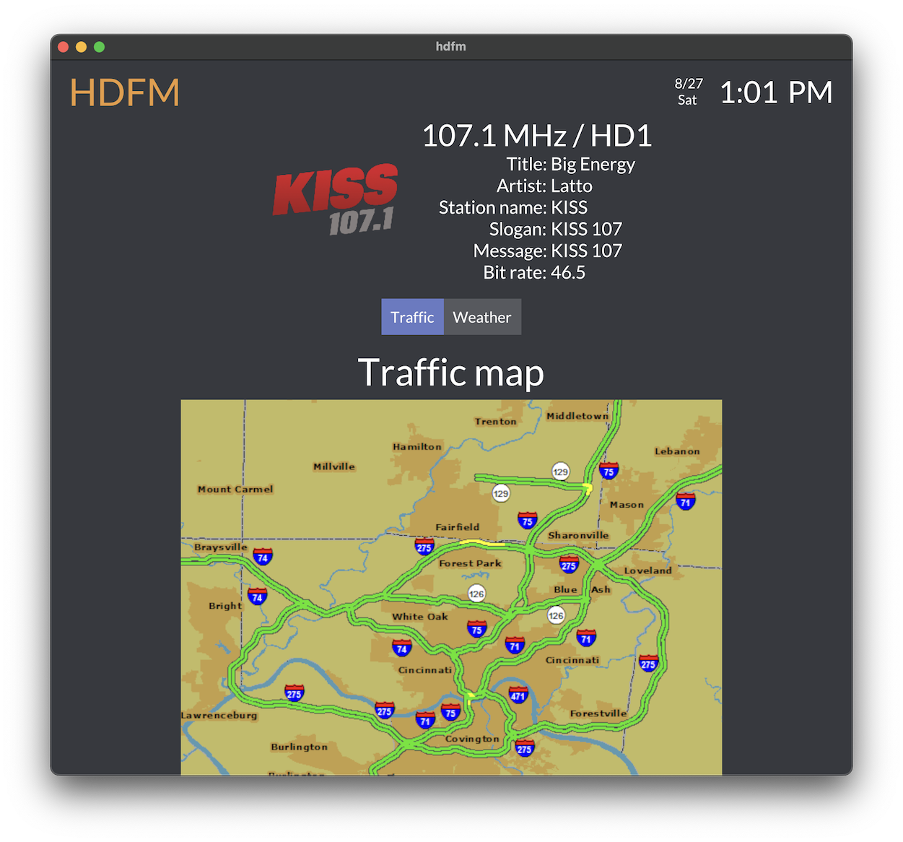

# HDFM - HD Radio GUI

View live data collected from HD Radio stations

<p align="center">
  
</p>
<hr>
<p align="center">
  
  
</p>

## Features

Uses [NRSC-5](https://github.com/theori-io/nrsc5) with an [RTL-SDR dongle](https://www.rtl-sdr.com/buy-rtl-sdr-dvb-t-dongles/) to display live data captured from HD Radio stations

Blazing fast, fully native Rust GUI application

GUI is styled like a digital car stereo system, displaying:

- Traffic map
- Weather radar
- Station/artist artwork
- Other station/song metadata

Requires no internet connection, so it can be used off the grid

## Pre-requisites

- An [rtl-sdr dongle](https://www.rtl-sdr.com/buy-rtl-sdr-dvb-t-dongles/)
- The [nrsc5 program](https://github.com/theori-io/nrsc5) installed

## Installation

### macOS

M1:

```bash
sudo curl -sSL 'https://github.com/KYDronePilot/hdfm/releases/download/v2.0.1/hdfm-aarch64-apple-darwin.tgz' | sudo tar xzv -C /usr/local/bin
```

Intel:

```bash
sudo curl -sSL 'https://github.com/KYDronePilot/hdfm/releases/download/v2.0.1/hdfm-x86_64-apple-darwin.tgz' | sudo tar xzv -C /usr/local/bin
```

### Windows

Run from an Administrator powershell prompt:

```powershell
Invoke-WebRequest -Uri "https://github.com/KYDronePilot/hdfm/releases/download/v2.0.1/hdfm-x86_64-pc-windows-msvc.zip" -OutFile "$env:temp\hdfm.zip"
Expand-Archive -Path "$env:temp\hdfm.zip" -DestinationPath C:\Windows
```

### Linux

**Note**: Requires Vulkan graphics.

x86_64:

```bash
sudo curl -sSL 'https://github.com/KYDronePilot/hdfm/releases/download/v2.0.1/hdfm-x86_64-unknown-linux-musl.tgz' | sudo tar xzv -C /usr/local/bin
```

aarch64:

```bash
sudo curl -sSL 'https://github.com/KYDronePilot/hdfm/releases/download/v2.0.1/hdfm-aarch64-unknown-linux-musl.tgz' | sudo tar xzv -C /usr/local/bin
```

## Usage

```
hdfm-rs 2.0.1

USAGE:
    hdfm [OPTIONS] <frequency> <program>

ARGS:
    <frequency>    Frequency of HD radio station
    <program>      HD radio program to tune (e.g. 1 for HD1, 2 for HD2, etc.) [possible values:
                   1, 2, 3, 4]

OPTIONS:
    -b, --nrsc5-bin <nrsc5_bin>    Path to nrsc5 binary (use if nrsc5 is not in your PATH) [default:
                                   nrsc5]
    -h, --help                     Print help information
    -l, --log-level <log_level>    Logging level (1=error, 2=warn, 3=info, 4=debug) [default: 2]
                                   [possible values: 1, 2, 3, 4]
    -s                             Disable audio output
    -V, --version                  Print version information
```

## Source code access

This project is released as "Pay-source" software. Precompiled binaries are provided under the [Releases](https://github.com/KYDronePilot/hdfm/releases) page for anyone to use.

If you would like to access the source code, please pay a one-time fee of $20 though GitHub Sponsors. You will then be given access to the private repository containing the code. With this access, you have permission to:

- Fork/clone and make modifications
- Build and distribute your own binaries
- Contribute back to the project and official binaries

You will not be permitted to distribute/publish the original and/or modified versions of the source code.

### [Click here to get source code access](https://github.com/sponsors/KYDronePilot/sponsorships?sponsor=KYDronePilot&tier_id=208482)

## Compatible radio stations

A list of nearby HD Radio stations can be found at: <https://hdradio.com/stations>

In addition, the station must be operated by iHeartRadio to access weather and traffic data. A list of iHeartRadio-owned stations in the US can be found here: <https://en.wikipedia.org/wiki/List_of_radio_stations_owned_by_iHeartMedia>

## Copyright

Copyright (c) 2022 Michael Galliers. All Rights Reserved.
